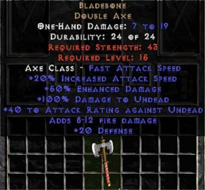

# {{ title }}

> ##### Voorkennis
> * programmeer-basics
> * (pre) programmeertaal: C#

> ##### Doel
> * Basis programmeren in C# en toepassen van drie van de vier pilaren van Object Oriented Programming in de C# taal:  
     - Encapsulation  
     - Inheritance  
     - Polymorphism

Als je meer met ASP.net wilt gaan doen is het noodzakelijk dat je meer kennis opdoet van C# en OOP (Object Oriented Programming); want alles draait op OOP principes als je met ASP.net gaat werken!

Omdat deze principes nogal abstract en pittig te omvatten kunnen zijn, worden deze concepten stapsgewijs geintroduceerd in opvolgende opdrachten. Door de stappen in deze opdrachten te volgen maak je uiteindelijk een werkende Textbased Adventure Game via een commandline applicatie! Waarom specifiek een game? De mechanieken van een game lenen zich heel goed uit voor de verschillende onderdelen van OOP en geeft je meer creatieve ruimte om te experimenteren.

Je bent ten alle tijden vrij om de opdrachten uit te breiden met eigen functies, designs en mechanics; zolang de opdrachten maar minimaal zijn uitgewerkt zoals beschreven.

***Opdrachten***

> &#128161; **TIP**: Voor alles wat je maakt met OOP, onthoud de <m>Single Responsibility Principle!</m>

 ## **Opdracht 1 - Once upon a time**

We beginnen eerst met het opzetten van onze speelomgeving. Start met een aantal <c>Console.WriteLine</c>'s om een introductie in onze game te maken (denk bijvoorbeeld aan <o>"Welcome Adventurer"</o>, of <o>"You wake up in a dark, damp cave!"</o>). Wees vrij om hier zelf iets moois van te maken. Vraag uiteindelijk via een <c>Console.ReadLine</c> om de speler's naam en stop die in een variabele. Begroet de speler in een laatste <c>Console.WriteLine</c> met zijn ingevulde naam. 

> &#128161; **TIP**: Met <c> Console.Write </c> kan je een regel uitprinten zonder een breakline (geen nieuwe regel).

Zoals je nu al ziet, en kan verwachten, gaan we heel veel Console.WriteLine's gebruiken om informatie te visualiseren voor de speler. Dit gaan wij simpeler maken met een eigen schrijf methode:

1. Maak een nieuwe, publieke, lege methode aan met een goed omschrijvende naam en geef het een <m>type string argument</m> mee (kies voor een logische benaming!). Deze methode moet de meegegeven string argument uitschrijven naar de console.

2. Elke <c>Console.WriteLine</c> die je hebt geschreven aan het begin van de opdracht vervang je met een call naar deze methode en vul je zijn argument in.

Het scheelt nu al redelijk wat typ werk als we nieuwe regels willen gaan uitprinten voor de speler, maar het blijft een beetje saai zo met alle witte tekst. Met <c>Console.ForegroundColor</c> zetten we een nieuwe kleur vast waarmee elk nieuwe regel tekst in die kleur wordt geschreven. Maak de volgende wijzigingen aan de gemaakte schrijf methode:

4. Voeg het wijzigen van kleur toe aan de schrijf methode. Zorg er voor dat de kleur van de tekst naderhand weer terugvalt op wit.

5. Voeg een extra optional argument toe aan de methode met de juiste type om een kleur mee te geven bij het aanroepen van de schrijf methode. Ken een wit waarde toe. 

De <c> Print </c> methode werkt nu zo dat als je geen tweede argument meegeeft, de text standaard wit wordt uitgeprint. Ken je wel een tweede argument toe met bijvoorbeeld ConsoleColor.Red, wordt de tekst rood afgedrukt.

6. Maak een extra schrijf methode om de Console.Write methode te gebruiken (inclusief kleurgebruik). 
    - *Bonus*: Breid alleen de bestaande Print methode uit met een extra argument zodat je kan meegeven of het een Write of WriteLine moet zijn.
---

 ## **Opdracht 2 - Humble Beginnings**
 
 We gaan beginnen met de 'meat' van ons spel: de combat. Hiervoor moet er gebruik gemaakt worden van 'objecten' zodat het aanmaken en bijhouden van vijanden een stuk makkelijker gaat.

 1. Maak twee nieuwe scripts aan voor een <c>Player</c> en <c>Enemy</c>. Geef beide klassen variabelen voor name, health en attack. Wijzig de setter van de variabelen zodat ze alleen opgehaald ('get') kunnen worden.

 > &#128680; <m>Zorg sowieso altijd voor logische **ENCAPSULATION** (publics an privates)!</m>

 2. Maak drie methodes (met argumenten) voor het invullen van de naam, het krijgen van schade en het zetten van de attack: 
     - <c>SetName()
     - <c>TakeDamage()
     - <c>SetAttack()

 3. Voeg bovenaan de 'main' script het aanmaken van het speler object. Wanneer om de speler zijn naam wordt gevraagd stop je de input in de naam variabele van de speler klassen. Vul op dit moment ook de spelers attack en de health variabelen in via de set methodes.

 4. Maak onderaan de 'main' code een enemy object aan en geeft het een naam, health en attack value via de set methodes. Vervolg het aanmaken van de vijand met een stukje tekst dat het monster verschijnt en maak gebruik van de naam. Toon ook de hoeveelheid health en attack.

>**Bonus**
Je kan een constructor gebruiken om het aanmaken van nieuwe objecten en het invullen van zijn variabelen te vereenvoudigen. Uiteindelijk heb je maar 1 regel code nodig! 

De objecten zijn nu klaar om te vechten en alles staat op een mooie volgorde. Voeg als laatst in de 'main' script helemaal bovenaan een nieuwe bool variabele gameOver toe en onderaan een while loop toe die blijft loopen tot gameOver waar is. Maak nu de volgende onderdelen:

 - Aan het begin van de loop moet de speler input geven met wat hij wilt doen. Wanneer de speler "Attack" intypt wordt de vijand object beschadigd door zijn TakeDamage methode aan te roepen en de spelers attack mee te geven als argument.
     - Vang onbekende commandos op. Bepaal zelf of de speler dan zijn beurt kwijt is of nog een kans krijgt.
 - Als de speler is geweest valt de vijand de speler aan op dezelfde manier als hierboven..
 - Laat met prints en verschillende kleuren zien wat er precies gebeurt.
 - Aan het einde van de loop wordt er gekeken of dat de speler of de enemy verslagen is; stop dan de loop en sluit het spel af met nog wat prints gebasseerd op wie er verslagen is.

> &#128221; **NOTE** Het herhalen van acties om tot een bepaalt resultaat te komen noemen we ook wel een *gameloop*

>**Extra**  
>Experimenteer met <c>Random()</c> om een variatie in <v>health</v> en <v>damage</v> te implementeren bij beide objecten.
>
>> &#128221; **NOTE** In Computer Role Playing Games (CRPGS in het kort) wordt de mogelijke schade vaak willekeurig bepaalt tussen een minimale en maximale waarde; zoals het Diablo 2 voorbeeld van een axe die, bij elke aanval, tussen 7 en 19 schade doet.
>>
>> 
>>
>>Je bent natuurlijk vrij om een heel wapen systeem te maken voor de speler en vijanden doormiddel van objecten!
>
>
>**Bonus** geef de enemy een random naam uit een namen verzameling.
>

---

 ## **Opdracht 3 - Adapt or die!**

Voor deze opdracht gaan wij Inheritance gebruiken om de herbruikbaar- en uitbreidbaarheid van onze objecten te verbeteren. We maken ook een paar wijzigingen aan de game mechanics wat al geschreven is.

1. Maak eerst een superklasse <c>Entity</c> en laat de <c>Player</c> en <c>Enemy</c> klasse hiervan overerven. Geef de Entity klasse de gedeelde variabelen en methodes die ALLEEN beide Player en Enemy hebben en haal ze weg bij de twee klassen.

2. Wijzig de loop zodat het begint met een check of er een enemy object aanwezig is. Zo niet, instantieer dan een nieuwe enemy object. Wijzig daarbij ook de gameover check: er kan alleen een gameover ontstaan als de speler verslagen wordt. 

>**Resultaat**  
> In essentie kan je nu oneindig blijven vechten tegen steeds nieuwe vijanden.

Op het moment gaat de speler niet ver kunnen komen tegen oneindig veel vijanden. Breid ALLEEN de Player class uit met de volgende mechanics:

3. Voeg een mechanic toe om te helen (levens weer terug krijgen). Gebruik hiervoor ook een <v>maxHealth</v> variabele zodat de speler niet meer HEALED dan mag. Zorg dat het healen een commando is die de speler kan typen tijdens een gevecht. 

> &#128221; **NOTE** Mechanics acties en functies die gespeeld kunnen worden en gezamenlijk een 'game' maken (denk aan schieten, springen, puzzles, racen etc.)

4. Voeg een mechanic toe voor de speler om te levelen (sterker worden). Met elke verslagen vijand krijgt de speler een x-aantal experience points (<bn>**extra** - dit kan natuurlijk met een random gebasseerd op een base exp value van de vijand</bn>). Wanneer de speler over een experience threshold komt gaat de speler 'level up' en gaan zijn maxHealth en Attack omhoog. Bedenk zelf wat voor waardes de speler nog meer kan hebben om hem te helpen en welke er verhoogd worden met een level up.

> &#128221; **NOTE** In CRPG's bepalen vaak 6 kern waardes, ook wel abilities genoemd, hoe sterk een speler is en wat hij wel of niet kan doen (zie het voorbeeld van Dungeons and Dragons).
>
> {{ '/_assets/csharp/TextBasedGame/DNDSheet.png' | image: 'DND Sheet', 50 }}
>
> 1. <b style = 'color: crimson'>Strength</b> - voor kracht en schade met melee wapens
> 2. <b style = 'color: lightgreen'>Dexterity</b> - voor behendigheid en schade met ranged wapens
> 3. <b style = 'color: peru'>Constitution</b> - voor uithoudingsvermogen en aantal levens
> 4. <b style = 'color: darkturquoise'>Intelligence</b> - hoeveel iets weet en voor spellcasting
> 5. <b style = 'color: blueviolet'>Wisdom</b> - hoe wijs iets is en voor spellcasting
> 6. <b style = 'color: orangered'>Charisma</b> - voor aantrekkingskracht en spellcasting

Bepaal ook zelf of de speler -*al*- zijn levens weer terugkrijgt bij een level up of dat hij ten alle tijden zichzelf moet helen (<bn>helen kan je ook uitbreiden naar een magie systeem wat gebruikt maakt van bijv. de intelligence waarde</bn>).

>**Resultaat**  
 De speler kan nu sterker worden door steeds meer vijanden te verslaan. Wanneer zijn levens te laag worden kan hij er ook voor kiezen om zichzelf te helen. Elke keer als een vijand verslagen wordt krijgt de speler experience points en wordt er weer een nieuwe monsters aangemaakt.

---
## **Opdracht 4 - Are they getting stronger?**

We gaan variatie in de speler en vijanden aanbrengen doormiddel van Polymorphisme.

> &#128221; **NOTE**: Polymorphisme is grieks voor meerdere (poly) vormen (morphism)

Creëer twee nieuwe klassen <c>TankEnemy</c> en <c>BlitzEnemy</c> en laat deze overerven van <c>Entity</c>.  Beide vijanden delen alle variabelen en methodes die er al zijn, maar hebben de volgende verschillen:

>Wanneer de speler aanvalt heeft hij een kans op een 'Critical Hit'. Wanneer dit gebeurt doet de speler meer schade. Hoeveel extra schade wordt bepaald door een critical damage variabele. Wanneer de speler een Critical Hit krijgt word bepaald door een critical rate variabelen. 
>> &#128161; **TIP**: Gebruik percentage berekeningen!
>
>De <c>TankEnemy</c> heeft een extra <v>variabele armorValue</v>. Elke keer als deze vijand schade krijgt, wordt de totale schade verminderd met de <v>armorValue</v>.
>
>De <c>BlitzEnemy</c> heeft elke keer als het aanvalt een kans om nog een keer aan te vallen. Deze kans begint hoog, maar wordt bij elke aanval kleiner.
>
>Polymorph de damage en aanval methodes zodat ze wel dezelfde methode naam en argumenten houden maar dat het de bovengenoemde functionaliteiten implementeert met hun unieke variabelen.

Laat deze nieuwe vijanden, samen met de originele, ook verschijnen in de gameloop bij gevechten doormiddel van kans.

**Bonus**
> Je bent zelf natuurlijk vrij om extra vijanden en mechanics toe te voegen!

---

## **Opdracht 5 - In a single file line, please!**

Voor deze opdracht ga je wat meer order creëren in de combat, met name de volgorde van wie als eerste acties mag uitvoeren!
 
Voeg een <c>Entity List</c> toe aan de main script. Alle entiteiten die meedoen in een gevecht worden toegevoegd aan deze list. Elke entiteit die verslagen wordt, wordt er ook weer uit gehaald.

Met de Entity List staand voer je de volgende stappen uit:

1. Ken aan <c>Entity</c> een nieuwe variabele <v>speed</v> met een default waarde van 1 toe. Zorg ervoor dat dit meegenomen wordt in een eventuele <m>constructor</m> en <m>getters</m> en <m>setters</m>. Speel ook weer met een Random() om varierende waardes toe te kennen aan speed.

2. Maak een nieuwe methode/functie <m>CombatSetup()</m> in de main, voor het opzetten van een nieuwe combat volgorde. Deze methode moet dus entiteiten in de list stoppen; op volgorde van de hoogste speed variabele tot de laagste. Het bepalen van de volgorde kan je uitvoeren met LINQ.

3. Wijzig de combat code zodat het gebruikt maakt van deze lijst. Zodra een entiteit zijn actie(s) heeft gedaan is de volgende in de lijst aan de beurt 
 
4.<c>Enemies</c> die aangemaakt worden met dezelfde naam (zoals Goblin) moeten een nummer aan hun naam toegevoegd krijgen (dus Goblin1, Goblin2). Breidt de commando's van de speler uit zodat er ook een naam opgegeven kan worden van de vijand om aan te vallen (bijv. Attack Goblin1).
 
>**Eindresultaat**  
Voordat combat begint worden alle entiteiten in het gevecht toegevoegd aan een lijst. Deze lijst wordt gesorteerd naar de snelheid van de entiteiten. Hierdoor ontstaat er een variërende volgorde in beurten: snellere entiteiten zijn als eerste aan de beurt! De speler kan kiezen uit meerdere targets om aan te vallen.

>>**Bonus**  
Voeg een mechanic toe dat de speed variabele van de entiteiten versneld/vertraagd kunnen worden tijdens combat. Bijvoorbeeld: wanneer een entiteit geraakt wordt met ice magic dan wordt zijn speed gehalveerd (waardoor hij dus later aan de beurt is). Hiervoor moet je dus alle entiteiten opnieuw sorteren nadat iedereen aan de beurt is geweest.

---

## **Super Bonus Opdracht 6 - What happens next?**
Voor deze opdracht ga je de mechanics die je op dit moment hebt gemaakt, opschonen en  uitbreiden. Voeg een gameState <c>Enum</c> toe:
 
  ><code>COMBAT  
  >STORY  
  >GAMEOVER</code>

1. Voeg een variabele voor de <v>gamestate</v> toe aan Program.cs. Maak het gehele combat segment zo dat het in een eigen methode/functie zit en alleen aangeroepen wordt als de gamestate COMBAT is. Maak nog twee extra methodes toe voor:
 
>STORY - comment een todo voor story segmenten (je hoeft hier dus nog geen logica voor te schrijven) 
>GAMEOVER - wanneer de speler zijn health op 0 of lager komt wordt de gamestate omgezet naar GAMEOVER.
 
2. Voeg in de <m>gameover</m> methode wat writelines toe over hoe de speler dood gaat en meld <o>"Game Over"</o>.
Het resultaat moet als volgt zijn:
 
>als de gamestate op COMBAT staat wordt de combat uitgevoerd zoals voorheen en kan de speler commando's geven om aan te vallen en/of items gebruiken (als je dat hebt geprogrammeerd), waarna de vijand de speler aanvalt. Er moet een functie zijn voor het wijzigen van de gamestate wanneer dat evt. nodig is. Dit moet altijd aan het einde van de gameloop gebeuren zodat de volgende loop methodes wordt bepaalt. Als de speler dood is word de gamestate omgezet naar GAMEOVER en word de gameover logica uitgevoerd.
 

Maak nu eerst een backup van jouw huidige project; deze opdracht is namelijk een flinke ingreep! Deze opdracht vraagt ook inzicht in code architectuur en kennis van <c>Linked Lists</c>!

3. Maak een nieuwe folder "Datastructures" aan. Maak binnen deze folder de benodigde klassen voor een <m>linkedlist</m>. Via een aparte klasse <c>StoryManager</c> ga je jouw text based adventure game afmaken: 
 
De <c>StoryManager</c> regelt de gameflow; per node in de linkedlist kijkt het of er een verhaal verteld moet worden of dat er combat moet starten. Dit kan je op de volgende manier doen. Voeg aan de node klasse een boolean <v>isCombat</v> toe. Deze variabele kan je op false zetten waar alleen een string uitgeschreven moet worden (story segment) en true wanneer de combat code moet starten zoals je het nu hebt geschreven. Vanuit de <c>GameManager</c> moet er eerst gekeken worden of de huidige linkedlist node een combat node is, om daarna de gamestate te veranderen naar de bijbehorende state (en zo dus de juiste code uitgevoerd wordt). Hier komt dus die gamestate switch goed van pas!
 
Als voorbeeld
>De GameManager kijkt naar de huidige gamestate: deze staat op STORY en kijkt naar de huidige linkedlist node. De isCombat boolean staat op false en de print methode van de huidige linkedlist node wordt uitgevoerd. De node data wordt via een Console.WriteLine uitgeschreven naar de console en de opvolgende node word nu de huidige node. 
> 
>De GameManager kijkt opnieuw naar de huidige gamestate: deze staat nog steeds op STORY en word er weer eerst gekeken naar de huidige linkedlist node. Hier is de isCombat boolean wel waar; de gamestate wordt gewijzigd naar COMBAT en de huidige node word alvast vervangen met de volgende node (deze node wordt nog niet gebruikt totdat combat voorbij is!). 
> 
>De GameManager kijkt opnieuw naar de huidige gamestate: deze staat op COMBAT en word vervolgens de combat code uitgevoerd tot dat alle vijanden verslagen zijn. Bij het verslaan van alle vijanden word de gamestate weer gewijzigd naar STORY en gaat het weer verder zoals gewoon.
 
Voeg een aantal nodes toe om een basic verhaal te vertellen met halverwege wat combat (minimaal drie nodes voor introductie, combat, afsluiting). 
 
>Bonus: voeg een keuze toe aan nodes. Geef de speler de opdracht om een keuze te maken na een kort verhaal. Houd het op twee keuzes die elk wijzen naar twee verschillende next nodes. Of deze nodes combat of story zijn mag je zelf bepalen. Beide routes wijzen naar dezelfde next node om de splitting weer samen te voegen.
